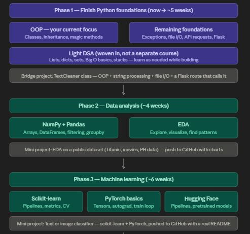
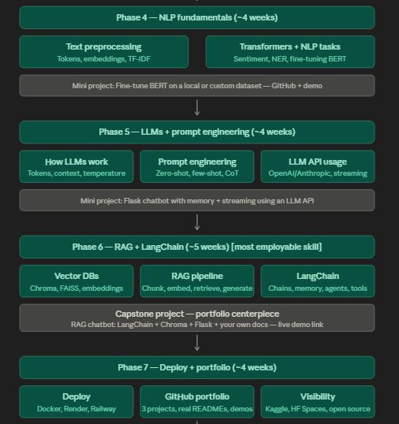

# 🤖 AI Engineering Roadmap Training

    
   
  <em>AI Engineering Roadmap Overview</em>

---

## 📌 About This Repository

This repository documents my structured journey toward becoming a **Production-Ready AI Engineer**.

It combines:

- 📚 Self-study
- 🛠️ Hands-on projects
- 🎓 Structured coursework (Harvard CS50)

The goal is to build strong, real-world foundations in:

> **Python • Data Science • Machine Learning • NLP • AI Systems**

---

## 🎯 Objectives

- Build strong Python foundations for AI & backend systems
- Learn data analysis, SQL, and data pipelines
- Develop and deploy machine learning models
- Understand NLP and modern AI/LLM systems
- Design backend AI services using Flask & FastAPI
- Apply core computer science concepts to AI systems

---

## 🧭 Learning Roadmap

### 📘 Core AI Engineering Path

- Python for AI Engineering
- Data Analysis & Machine Learning
- NLP & LLM Systems
- AI System Design & Deployment

### 🎓 CS50 Integration (Foundation Layer)

Harvard CS50 strengthens core engineering skills that directly support AI development:

- Problem-solving & algorithmic thinking
- Python programming fundamentals
- Web development (Flask, backend logic)
- Core AI & machine learning principles
- Data structures & system design basics

---

## 🧠 Phases Breakdown

### 🟢 Phase 1: Python Foundations

- Syntax, data types, control flow
- Functions & OOP
- File handling & modules
- API requests (basic understanding)

---

### 🔵 Phase 2: Data Analysis

- NumPy & Pandas
- Data cleaning & preprocessing
- Exploratory Data Analysis (EDA)
- SQL fundamentals
- Data visualization

---

### 🟡 Phase 3: Machine Learning

- Supervised & unsupervised learning
- Feature engineering
- Model evaluation
- ML pipelines
- CS50 AI concept integration

---

### 🟣 Phase 4: NLP (Natural Language Processing)

- Text preprocessing & embeddings
- Sentiment analysis
- Text classification
- RNN / LSTM basics
- Transformers introduction

---

### 🔴 Phase 5: AI Engineering (Backend Systems)

- Flask / FastAPI (production APIs)
- REST API design for ML models
- API testing using Postman
- Handling requests, responses, and JSON data
- Model deployment workflows
- Logging & error handling
- Scalable backend architecture

---

### ⚫ Phase 6: Advanced AI Systems (LLM + RAG)

- LLM integration (OpenAI APIs)
- Prompt engineering
- Embeddings & vector databases
- Retrieval-Augmented Generation (RAG)
- AI agents & tool usage

---

### 🟤 Phase 7: Capstone Projects

- Full-stack AI applications
- React + Python backend integration
- RAG chatbot systems
- Authentication & database systems
- Deployment (Docker / Cloud)

---

## 📊 Progress Tracking

Each phase includes:

- ✅ Structured lessons
- 🧪 Practice exercises
- 🔧 Mini-projects
- 🚀 Production-level AI systems

---

# 👨‍💻 Author

**Carl Joshua M. Coloma**  
Computer Science – Software Engineering  
AI Engineering Track
